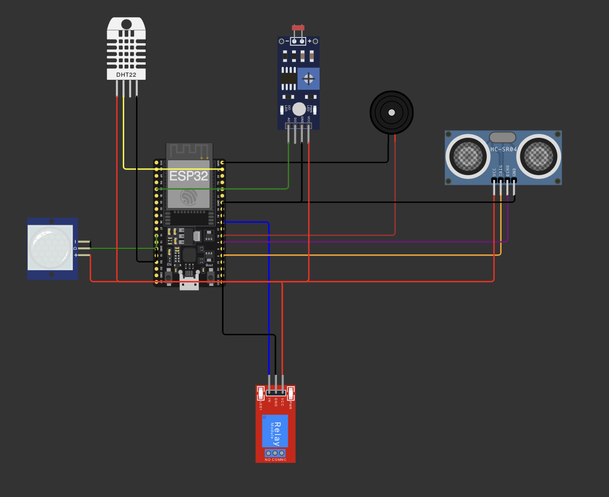
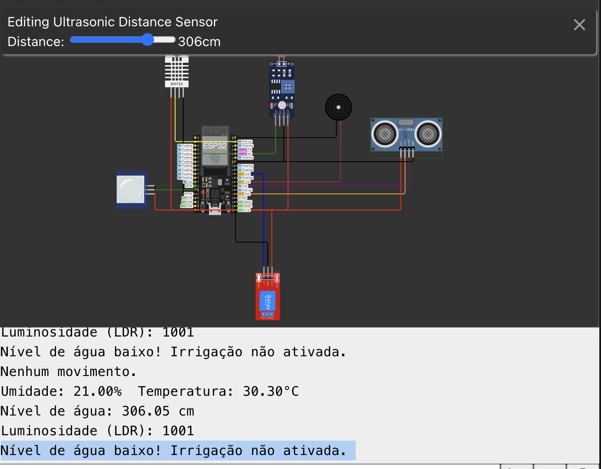
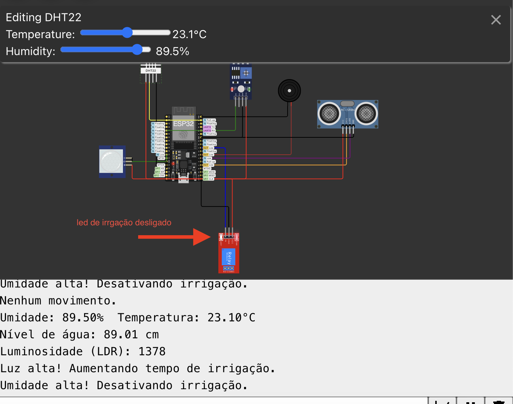
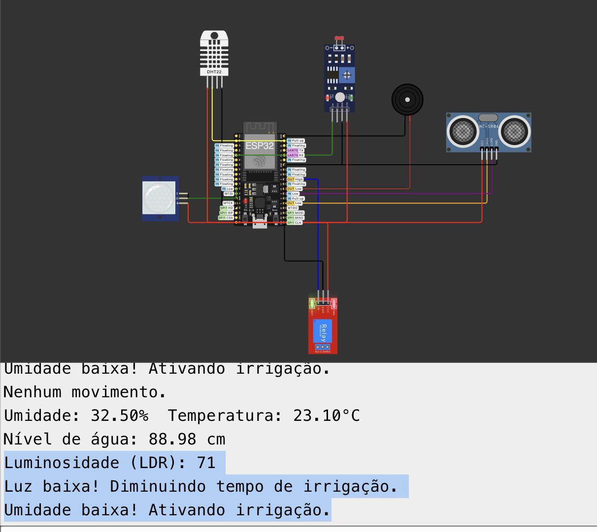
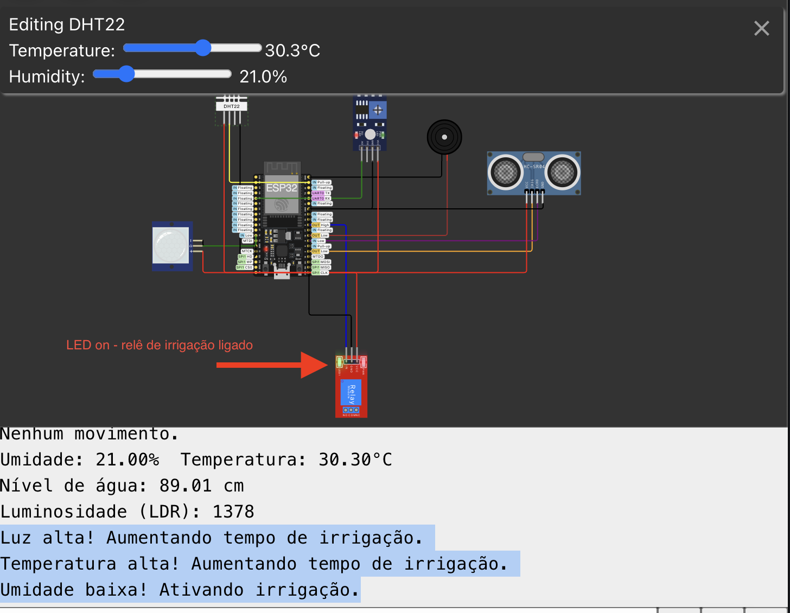
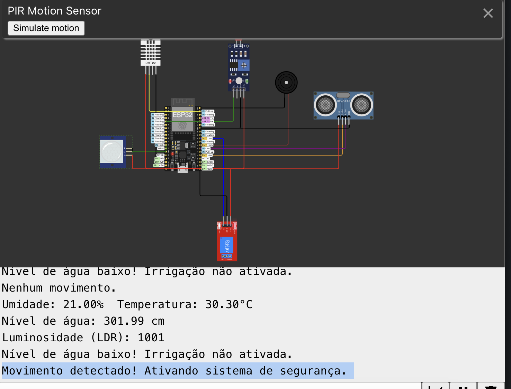

# FIAP - Faculdade de Informática e Administração Paulista

<p align="center">
<a href= "https://www.fiap.com.br/"></a>
</p>

<br>

# Sistema Inteligente de Monitoramento Agrícola - Cap 12 - A Eletrônica de uma IA

Grupo 11

## 👨‍🎓 Integrantes: 
- <a href="https://www.linkedin.com/in/edu-ramos/">Eduardo Augusto Ramos</a>

## 👩‍🏫 Professores:
### Tutor(a) 
- Lucas
### Coordenador(a)
- André

## 📜 Descrição

O objetivo deste projeto é criar um sistema inteligente de monitoramento agrícola usando o microcontrolador ESP32 e quatro sensores diferentes descritos na atividade. O sistema será capaz de coletar dados do ambiente e tomar decisões automatizadas para otimizar o uso de recursos na agricultura, como a irrigação e o controle de condições climáticas.

### Sensores / Componentes utilizados:

1. **Sensor de umidade e temperatura (DHT22)**: para medir a temperatura e a umidade do ambiente, fornecendo dados críticos para o controle da irrigação.
2. **Sensor de ultrassom (HC-SR04)**: para medir a distância de líquidos em reservatórios de água, ajudando a monitorar o nível de água disponível para irrigação.
3. **Sensor de movimento PIR**: para detectar a presença de animais ou pessoas em áreas monitoradas, sendo útil para segurança e vigilância em áreas agrícolas.
4. **Sensor de luz LDR (Light Dependent Resistor)**: para monitorar a intensidade da luz solar, permitindo ajustar a irrigação e a proteção das plantas conforme a quantidade de luz recebida.
5. **Buzzer**: para emitir alertas sonoros em caso de detecção de presença.
6. **Relé**: atua como controlador do sistema de irrigação, ligando e desligando a bomba de água conforme as condições monitoradas pelos sensores.

### Funcionalidades:

1. **Monitoramento climático**: com o DHT22, o sistema mede constantemente a umidade e temperatura do ambiente, enviando alertas ou tomando ações automáticas para aumentar ou diminuir a irrigação dependendo das condições.
2. **Controle de irrigação automatizada**: o sensor HC-SR04 verifica o nível de água nos tanques e aciona a irrigação apenas quando o nível está adequado, evitando desperdício de água.
3. **Detecção de presença**: o sensor PIR pode ser utilizado para detectar invasões de animais ou pessoas em áreas restritas da fazenda, ativando alarmes ou sistemas de segurança.
4. **Ajuste de irrigação com base na luminosidade**: o sensor LDR mede a quantidade de luz solar recebida e ajusta a irrigação automaticamente, diminuindo a quantidade de água em dias mais ensolarados e aumentando em dias nublados.
5. **Alertas sonoros**: o buzzer emite sons de alerta em caso de detecção de presença de algo
6. **Controle do sistema de irrigação**: o relé controla a bomba de água, ligando e desligando conforme as condições monitoradas pelos sensores, garantindo uma irrigação eficiente e automatizada.

## 📁 Estrutura de pastas

Dentre os arquivos e pastas presentes na raiz do projeto, definem-se:

- **/src**: códigos-fonte do projeto.
- **/docs**: documentação do projeto, incluindo a descrição do sistema e explicações sobre cada sensor.
- **/tests**: testes automatizados ou manuais para validar o funcionamento do projeto.
- **README.md**: arquivo que serve como guia e explicação geral sobre o projeto (o mesmo que você está lendo agora).

## 🔧 Como executar o código no Wokwi

Pré-requisitos
- Simulador: Wokwi.com

Passo a passo
1. Clone o repositório:
```sh
git clone https://github.com/eduduardo/projeto-cap-12.git
cd projeto-cap-12
```

2. Acesse o Wokwi:
- Vá para Wokwi.com.
3. Acesse o projeto: https://wokwi.com/projects/412186039656924161
4. Inicie uma nova simulação:
- Clique em Start Simulation para iniciar a simulação.
5. Verifique a saída no Monitor Serial:
- Utilize o Monitor Serial do Wokwi para visualizar as mensagens de funcionamento do sistema.

## Como instalar as dependencias no wokwi
Para instalar as dependências no Wokwi, siga os passos abaixo:

1. **Acesse o Wokwi**:
   - Abra o navegador e vá para [Wokwi](https://wokwi.com/).

2. **Crie um novo projeto ou acesse um projeto**:

3. **Instale bibliotecas**:
   - Clique no ícone de "Library Manager" na barra lateral.
   - Pesquise e selecione as bibliotecas que você precisa para o seu projeto. No caso precisamos da `DHT sensor library` => https://www.arduinolibraries.info/libraries/dht-sensor-library
   - Clique em "Add" para adicionar a biblioteca ao seu projeto.

## Diagrama de componentes



--- 

## Testes

### 1. Irrigação Desligada - Nível de Água Baixa

- **Descrição**: Este teste verifica o comportamento do sistema quando a irrigação está desligada e o nível de água está baixo.
- **Expectativa**: O relê deve permanecer desligado, indicando que a irrigação não será ativada mesmo com o nível de água baixo.

### 2. Irrigação Desligada - Umidade Alta

- **Descrição**: Este teste verifica o comportamento do sistema quando a irrigação está desligada e a umidade do solo está alta.
- **Expectativa**: O relê do sistema deve permanecer desligado, pois a umidade alta indica que não há necessidade de irrigação.

### 3. Irrigação Ligada - Umidade Baixa, Luz Baixa, Diminui Tempo

- **Descrição**: Este teste verifica o comportamento do sistema quando a irrigação está ligada, a umidade do solo está baixa, a luz está baixa e o tempo de irrigação é reduzido.
- **Expectativa**: O relê do sistema deve ligar a irrigação para aumentar a umidade do solo, considerando as condições de baixa luz e ajustando o tempo de irrigação.

### 4. Irrigação Ligada - Umidade Baixa, Temperatura Alta, Luz Alta

- **Descrição**: Este teste verifica o comportamento do sistema quando a irrigação está ligada, a umidade do solo está baixa, a temperatura está alta e a luz está alta.
- **Expectativa**: O relê do sistema deve ligar a irrigação para aumentar a umidade do solo, considerando as condições de alta temperatura e alta luz.

### 5. Movimento Detectado

- **Descrição**: Este teste verifica o comportamento do sistema quando um movimento é detectado.
- **Expectativa**: O sistema deve registrar o movimento detectado e, aciona o buzzer com um aviso sonoro.


## 🗃 Histórico de lançamentos

* 0.1.0 * - 20/10/2024

## 📋 Licença

<p xmlns:cc="http://creativecommons.org/ns#" xmlns:dct="http://purl.org/dc/terms/"><a property="dct:title" rel="cc:attributionURL" href="https://github.com/agodoi/template">MODELO GIT FIAP</a> por <a rel="cc:attributionURL dct:creator" property="cc:attributionName" href="https://fiap.com.br">Fiap</a> está licenciado sobre <a href="http://creativecommons.org/licenses/by/4.0/?ref=chooser-v1" target="_blank" rel="license noopener noreferrer" style="display:inline-block;">Attribution 4.0 International</a>.</p>